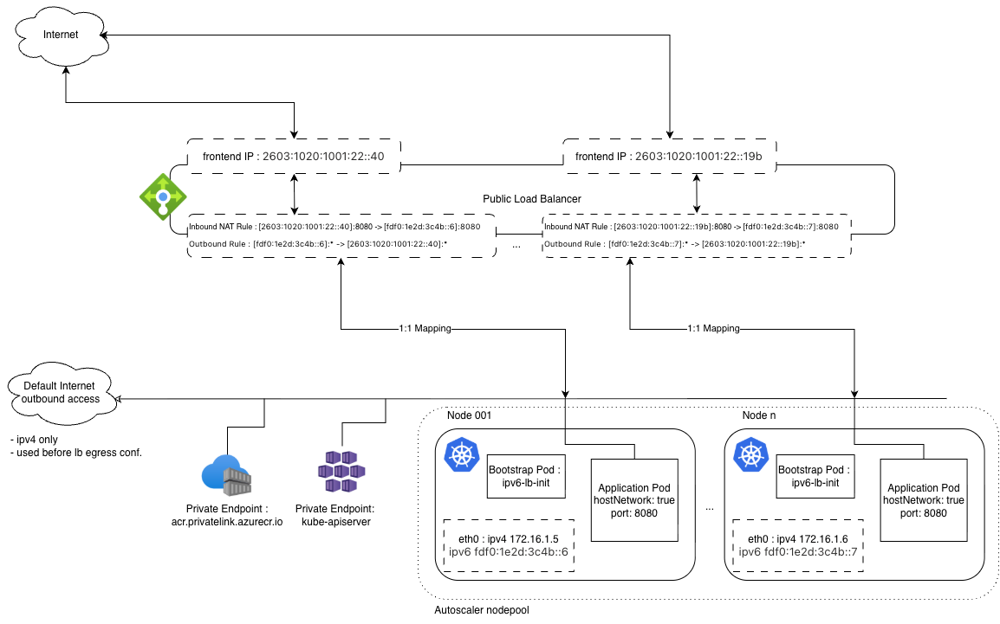

# ipv6-vmss-manager

Automatically configures an Azure Standard Load Balancer with per-node IPv6 public addresses for AKS VMSS nodes. Runs as a DaemonSet so every node in the cluster gets its own LB setup, and a CronJob to clean up orphaned resources when nodes are removed.

> **See also:** [Architecture diagram and project overview](../README.md)

---

## Table of contents

1. [Overview](#1-overview)
2. [Infrastructure setup](#2-infrastructure-setup)
   - [2.1 Resource group and VNet](#21-resource-group-and-vnet)
   - [2.2 Azure Container Registry (private)](#22-azure-container-registry-private)
   - [2.3 Managed identities](#23-managed-identities)
   - [2.4 AKS cluster creation](#24-aks-cluster-creation)
   - [2.5 Jump VM for private-cluster access](#25-jump-vm-for-private-cluster-access)
3. [Manual LB setup (per-node)](#3-manual-lb-setup-per-node)
   - [3.1 Create the Standard Load Balancer](#31-create-the-standard-load-balancer)
   - [3.2 Step A — Backend address pool](#32-step-a--backend-address-pool)
   - [3.3 Step B — Public IPv6 and frontend IP](#33-step-b--public-ipv6-and-frontend-ip)
   - [3.4 Step C — Outbound rule](#34-step-c--outbound-rule)
   - [3.5 Step D — Inbound NAT rule](#35-step-d--inbound-nat-rule)
   - [3.6 Repeat for additional nodes](#36-repeat-for-additional-nodes)
4. [Automated solution (DaemonSet + CronJob)](#4-automated-solution-daemonset--cronjob)
   - [4.1 Workload Identity setup](#41-workload-identity-setup)
   - [4.2 Configuration (ConfigMap)](#42-configuration-configmap)
   - [4.3 Deploy the automation](#43-deploy-the-automation)
   - [4.4 Verify](#44-verify)
   - [4.5 Orphan cleanup (CronJob)](#45-orphan-cleanup-cronjob)
5. [Naming conventions](#5-naming-conventions)
6. [Files](#6-files)
7. [Troubleshooting](#7-troubleshooting)

---

## 1. Overview

**Problem:** AKS dual-stack clusters with `outbound-type: none` have no default IPv6 internet egress. Each node needs a dedicated public IPv6 address for outbound (and optionally inbound) connectivity.

**Solution:** A Standard Load Balancer with a 1:1 mapping between each VMSS node and a public IPv6 frontend IP. Each node gets its own backend pool, outbound rule, and inbound NAT rule.



### What it does (per node)

1. **Backend pool** — creates an LB backend address pool using the node's private IPv6 address.
2. **Public IPv6 from prefix** — allocates a public IPv6 address from an IPv6 prefix (`/124`). If the current prefix is full, it creates a new one and retries.
3. **Frontend IP** — assigns the public IPv6 as a frontend IP on the load balancer.
4. **Outbound rule** — creates an outbound rule (all protocols) linking the frontend to the backend pool.
5. **Inbound NAT rule** — creates a TCP inbound NAT rule on port 8080 (configurable via `NAT_PORT`).

All steps are **idempotent** — re-running the script on the same node is safe.

**Two approaches are documented:**

| Approach | When to use |
|---|---|
| [Manual (Section 3)](#3-manual-lb-setup-per-node) | Learning/testing, one-time setup, fixed-size clusters |
| [Automated (Section 4)](#4-automated-solution-daemonset--cronjob) | Production, autoscaled node pools, self-healing |

---

## 2. Infrastructure setup

### 2.1 Resource group and VNet

```bash
# Enable multi-IP support (one-time, subscription level)
az feature register --namespace "Microsoft.Network" -n "AllowMultipleIpConfigurationsPerNic"
az provider register -n Microsoft.Network

# Variables
LOCATION="swedencentral"
RG="customer-rg"
VNET="customer-vnet"
SUBNET="customer-snet-aks"
VNET_V4="172.16.0.0/16"
VNET_V6="fdf0:1e2d:3c4b::/48"
SUBNET_V4="172.16.1.0/24"
SUBNET_V6="fdf0:1e2d:3c4b::/64"

# Create resource group
az group create -n "$RG" -l "$LOCATION"

# Create dual-stack VNet + AKS subnet
az network vnet create \
  -g "$RG" -n "$VNET" -l "$LOCATION" \
  --address-prefixes "$VNET_V4" "$VNET_V6" \
  --subnet-name "$SUBNET" \
  --subnet-prefixes "$SUBNET_V4" "$SUBNET_V6"
```

### 2.2 Azure Container Registry (private)

Since the cluster uses `outbound-type: none`, a private ACR with a cache rule and private endpoint is required for pulling images.

```bash
SUBNET_ACR="customer-snet-acr"
SUBNET_ACR_V4="172.16.2.0/24"

# ACR subnet
az network vnet subnet create \
  --name "$SUBNET_ACR" --vnet-name "$VNET" --resource-group "$RG" \
  --address-prefixes "$SUBNET_ACR_V4" \
  --private-endpoint-network-policies Disabled

# Create Premium ACR (required for private endpoints)
ACR_NAME="customeracr${RANDOM}"
az acr create -g "$RG" --name "$ACR_NAME" --sku Premium --public-network-enabled false

REGISTRY_ID=$(az acr show --name "$ACR_NAME" -g "$RG" --query id -o tsv)

# MCR cache rule so AKS can pull system images
az acr cache create -n aks-managed-mcr -r "$ACR_NAME" -g "$RG" \
  --source-repo "mcr.microsoft.com/*" --target-repo "aks-managed-repository/*"

# Private endpoint for ACR
az network private-endpoint create \
  --name ACRCacheEndpoint --resource-group "$RG" \
  --vnet-name "$VNET" --subnet "$SUBNET_ACR" \
  --private-connection-resource-id "$REGISTRY_ID" \
  --group-id registry --connection-name myConnection

# Private DNS zone for ACR
az network private-dns zone create -g "$RG" --name "privatelink.azurecr.io"
az network private-dns link vnet create -g "$RG" \
  --zone-name "privatelink.azurecr.io" --name MyDNSLink \
  --virtual-network "$VNET" --registration-enabled false

# Get private IPs and create DNS records
NETWORK_INTERFACE_ID=$(az network private-endpoint show --name ACRCacheEndpoint -g "$RG" \
  --query 'networkInterfaces[0].id' -o tsv)
REGISTRY_PRIVATE_IP=$(az network nic show --ids "$NETWORK_INTERFACE_ID" \
  --query "ipConfigurations[?privateLinkConnectionProperties.requiredMemberName=='registry'].privateIPAddress" -o tsv)
DATA_ENDPOINT_PRIVATE_IP=$(az network nic show --ids "$NETWORK_INTERFACE_ID" \
  --query "ipConfigurations[?privateLinkConnectionProperties.requiredMemberName=='registry_data_${LOCATION}'].privateIPAddress" -o tsv)

az network private-dns record-set a create --name "$ACR_NAME" \
  --zone-name "privatelink.azurecr.io" -g "$RG"
az network private-dns record-set a add-record --record-set-name "$ACR_NAME" \
  --zone-name "privatelink.azurecr.io" -g "$RG" --ipv4-address "$REGISTRY_PRIVATE_IP"

az network private-dns record-set a create --name "${ACR_NAME}.${LOCATION}.data" \
  --zone-name "privatelink.azurecr.io" -g "$RG"
az network private-dns record-set a add-record --record-set-name "${ACR_NAME}.${LOCATION}.data" \
  --zone-name "privatelink.azurecr.io" -g "$RG" --ipv4-address "$DATA_ENDPOINT_PRIVATE_IP"
```

### 2.3 Managed identities

```bash
CLUSTER_IDENTITY_NAME="customer-aks-identity"
KUBELET_IDENTITY_NAME="customer-aks-kubelet-identity"

az identity create --name "$CLUSTER_IDENTITY_NAME" -g "$RG"
az identity create --name "$KUBELET_IDENTITY_NAME" -g "$RG"

CLUSTER_IDENTITY_RESOURCE_ID=$(az identity show -n "$CLUSTER_IDENTITY_NAME" -g "$RG" --query id -o tsv)
KUBELET_IDENTITY_RESOURCE_ID=$(az identity show -n "$KUBELET_IDENTITY_NAME" -g "$RG" --query id -o tsv)
KUBELET_IDENTITY_PRINCIPAL_ID=$(az identity show -n "$KUBELET_IDENTITY_NAME" -g "$RG" --query principalId -o tsv)

# Grant kubelet AcrPull on the registry
az role assignment create --role AcrPull --scope "$REGISTRY_ID" \
  --assignee-object-id "$KUBELET_IDENTITY_PRINCIPAL_ID" \
  --assignee-principal-type ServicePrincipal
```

### 2.4 AKS cluster creation

```bash
AKS="customer-aks-byo"
SUBNET_ID=$(az network vnet subnet show -g "$RG" --vnet-name "$VNET" -n "$SUBNET" --query id -o tsv)

# Dual-stack CIDRs
POD_CIDR_V4="10.244.0.0/16"
POD_CIDR_V6="fd12:3456:789a::/64"
SVC_CIDR_V4="10.0.0.0/16"
SVC_CIDR_V6="fd12:3456:789a:1::/108"
DNS_IP_V4="10.0.0.10"

az aks create \
  -g "$RG" -n "$AKS" -l "$LOCATION" \
  --vnet-subnet-id "$SUBNET_ID" \
  --assign-identity "$CLUSTER_IDENTITY_RESOURCE_ID" \
  --assign-kubelet-identity "$KUBELET_IDENTITY_RESOURCE_ID" \
  --enable-managed-identity \
  --network-plugin azure \
  --network-plugin-mode overlay \
  --ip-families ipv4,ipv6 \
  --pod-cidrs "$POD_CIDR_V4,$POD_CIDR_V6" \
  --service-cidrs "$SVC_CIDR_V4,$SVC_CIDR_V6" \
  --nodepool-name "system" \
  --node-count 3 \
  --bootstrap-artifact-source Cache \
  --bootstrap-container-registry-resource-id "$REGISTRY_ID" \
  --outbound-type none \
  --enable-private-cluster \
  --generate-ssh-keys
```

> **Note:** `--outbound-type none` means the cluster has no default internet egress. IPv4 connectivity for system components comes through private endpoints. IPv6 egress will be handled by the Load Balancer created in the next sections.

### 2.5 Jump VM for private-cluster access

Since this is a private cluster, you need a VM inside the VNet (or Bastion) to run `kubectl`:

```bash
VM_NAME="jump-vm-1"
NIC_NAME="${VM_NAME}-nic"
IPV4_PIP_NAME="${VM_NAME}-pip4"

# Create NIC with IPv4 + IPv6 configs
az network public-ip create -g "$RG" -n "$IPV4_PIP_NAME" -l "$LOCATION" \
  --sku Standard --version IPv4

az network nic create -g "$RG" -n "$NIC_NAME" -l "$LOCATION" \
  --vnet-name "$VNET" --subnet "$SUBNET" \
  --public-ip-address "$IPV4_PIP_NAME"

az vm create -g "$RG" -n "$VM_NAME" -l "$LOCATION" \
  --image Ubuntu2204 --nics "$NIC_NAME" \
  --admin-username customeradmin --generate-ssh-keys

# Get kubeconfig
az aks get-credentials -g "$RG" -n "$AKS" --overwrite-existing
```

---

## 3. Manual LB setup (per-node)

This section shows how to configure the LB manually for a single node. **This is what the automation (Section 4) does automatically for every node.**

### 3.1 Create the Standard Load Balancer

```bash
LB_NAME="customer-ext-lb"

az network lb create \
  -g "$RG" -n "$LB_NAME" -l "$LOCATION" --sku Standard
```

### 3.2 Step A — Backend address pool

Create a backend pool that targets the node's **private IPv6 address** by IP (not NIC):

```bash
# For VMSS instance 0:
VM="aks-system-34603732-vmss000000"
INT_PIP6="fdf0:1e2d:3c4b::4"            # Private IPv6 from the node's NIC

FE_NAME="${VM}-pip6"
BE_NAME="${VM}-BE-ipv6"
INBOUND_RULE_NAME="${VM}-in-rule"
OUT_RULE_NAME="${VM}-out-rule"

az network lb address-pool create \
  --resource-group "$RG" \
  --lb-name "$LB_NAME" \
  --name "$BE_NAME" \
  --vnet "$VNET" \
  --backend-addresses "[{name:addr1,ip-address:'$INT_PIP6'}]"
```

> **How to find the private IPv6:** For VMSS nodes, use:
> ```bash
> az vmss nic list-vm-nics -g "$MC_RG" --vmss-name "$VMSS" --instance-id 0 \
>   --query "[0].ipConfigurations[?privateIPAddressVersion=='IPv6'].privateIPAddress | [0]" -o tsv
> ```

### 3.3 Step B — Public IPv6 and frontend IP

```bash
# Create a public IPv6 address
az network public-ip create \
  -g "$RG" -n "$FE_NAME" -l "$LOCATION" \
  --sku Standard --allocation-method Static --version IPv6

# Assign the PIP as a frontend IP on the LB
az network lb frontend-ip create \
  -g "$RG" -n "$FE_NAME" --lb-name "$LB_NAME" \
  --public-ip-address "$FE_NAME"
```

> **Production note:** The automation allocates PIPs from `/124` IPv6 prefixes (16 IPs each) and rotates to a new prefix when full. See [configmap.yaml](configmap.yaml) for prefix logic.

### 3.4 Step C — Outbound rule

This enables IPv6 egress from the node through the LB frontend:

```bash
az network lb outbound-rule create \
  -g "$RG" --lb-name "$LB_NAME" \
  --name "$OUT_RULE_NAME" \
  --frontend-ip-configs "$FE_NAME" \
  --backend-address-pool "$BE_NAME" \
  --protocol All
```

### 3.5 Step D — Inbound NAT rule

This allows inbound IPv6 traffic on a specific port (e.g. 8080) to reach the node:

```bash
az network lb inbound-nat-rule create \
  -g "$RG" --lb-name "$LB_NAME" \
  --name "$INBOUND_RULE_NAME" \
  --protocol TCP \
  --frontend-ip-name "$FE_NAME" \
  --frontend-port-range-start 8080 \
  --frontend-port-range-end 8080 \
  --floating-ip false \
  --backend-port 8080 \
  --backend-address-pool "$BE_NAME"
```

### 3.6 Repeat for additional nodes

Repeat Steps A–D for each node, substituting the computer name and private IPv6. For example:

| Instance | Computer Name | Private IPv6 |
|---|---|---|
| `vmss_0` | `aks-system-34603732-vmss000000` | `fdf0:1e2d:3c4b::4` |
| `vmss_1` | `aks-system-34603732-vmss000001` | `fdf0:1e2d:3c4b::5` |
| `vmss_2` | `aks-system-34603732-vmss000002` | `fdf0:1e2d:3c4b::6` |

**This gets tedious quickly** — and impossible to maintain when the autoscaler adds/removes nodes. That's what the automated solution solves.

---

## 4. Automated solution (DaemonSet + CronJob)

The automation runs the same Steps A–D from Section 3, but automatically for every node, with retry logic for LB concurrency conflicts and prefix rotation when prefixes fill up.

### 4.1 Workload Identity setup

The DaemonSet and CronJob authenticate to Azure using Workload Identity. This is a one-time setup.

#### 4.1.1 Enable Workload Identity on AKS

```bash
az aks update -g "$RG" -n "$AKS" \
  --enable-oidc-issuer --enable-workload-identity

OIDC_ISSUER=$(az aks show -g "$RG" -n "$AKS" \
  --query "oidcIssuerProfile.issuerUrl" -o tsv)
```

#### 4.1.2 Create the managed identity

```bash
IPV6_IDENTITY_NAME="ipv6-manager-identity"
az identity create --name "$IPV6_IDENTITY_NAME" -g "$RG" -l "$LOCATION"

USER_ASSIGNED_CLIENT_ID=$(az identity show -n "$IPV6_IDENTITY_NAME" -g "$RG" --query clientId -o tsv)
USER_ASSIGNED_PRINCIPAL_ID=$(az identity show -n "$IPV6_IDENTITY_NAME" -g "$RG" --query principalId -o tsv)
```

#### 4.1.3 Assign RBAC roles

The identity needs permissions on **two** resource groups:

| Resource Group | Role | Why |
|---|---|---|
| `customer-rg` (infra) | Network Contributor | Manage LB, PIPs, prefixes |
| `MC_customer-rg_customer-aks-byo_swedencentral` (nodes) | Network Contributor | Read VMSS NICs |
| `MC_customer-rg_customer-aks-byo_swedencentral` (nodes) | Virtual Machine Contributor | Read VMSS instance metadata |

```bash
SUBSCRIPTION_ID="a303e0dc-f916-4c4a-8af1-e40f6163e1bb"
NODE_RG=$(az aks show -g "$RG" -n "$AKS" --query nodeResourceGroup -o tsv)

# Infra RG — manage LB, PIPs, prefixes
az role assignment create --role "Network Contributor" \
  --assignee-object-id "$USER_ASSIGNED_PRINCIPAL_ID" \
  --assignee-principal-type "ServicePrincipal" \
  --scope "/subscriptions/$SUBSCRIPTION_ID/resourceGroups/$RG"

# Node RG — read VMSS NICs
az role assignment create --role "Network Contributor" \
  --assignee-object-id "$USER_ASSIGNED_PRINCIPAL_ID" \
  --assignee-principal-type "ServicePrincipal" \
  --scope "/subscriptions/$SUBSCRIPTION_ID/resourceGroups/$NODE_RG"

# Node RG — read VMSS instance metadata
az role assignment create --role "Virtual Machine Contributor" \
  --assignee-object-id "$USER_ASSIGNED_PRINCIPAL_ID" \
  --assignee-principal-type "ServicePrincipal" \
  --scope "/subscriptions/$SUBSCRIPTION_ID/resourceGroups/$NODE_RG"
```

#### 4.1.4 Create a Federated Credential

```bash
az identity federated-credential create \
  --name "ipv6-manager-fed" \
  --identity-name "$IPV6_IDENTITY_NAME" \
  --resource-group "$RG" \
  --issuer "$OIDC_ISSUER" \
  --subject "system:serviceaccount:kube-system:ipv6-manager-sa" \
  --audience api://AzureADTokenExchange
```

#### 4.1.5 Update the ServiceAccount manifest

Set the client ID in [service-account.yaml](service-account.yaml):

```bash
sed -i "s|<USER_ASSIGNED_CLIENT_ID>|$USER_ASSIGNED_CLIENT_ID|" \
  ipv6-vmss-manager/service-account.yaml
```

### 4.2 Configuration (ConfigMap)

Edit the environment variables in [configmap.yaml](configmap.yaml):

| Variable | Default | Description |
|---|---|---|
| `LB_NAME` | `customer-ext-lb` | Name of the Standard Load Balancer |
| `VNET_NAME` | `customer-vnet` | VNet containing the AKS subnet |
| `INFRA_RG` | `customer-rg` | Resource group for LB, PIPs, and prefixes |
| `PREFIX_BASE_NAME` | `aks-lb-ipv6-prefix` | Base name for `/124` IPv6 prefixes |
| `NAT_PORT` | `8080` | Port for the inbound NAT rule |

### 4.3 Deploy the automation

```bash
kubectl apply -f ipv6-vmss-manager/service-account.yaml
kubectl apply -f ipv6-vmss-manager/configmap.yaml
kubectl apply -f ipv6-vmss-manager/daemonset.yaml
kubectl apply -f ipv6-vmss-manager/cronjob.yaml
```

### 4.4 Verify

Check that each node's DaemonSet pod completed successfully:

```bash
# List pods
kubectl get pods -n kube-system -l app=ipv6-lb-manager -o wide

# Follow logs for a specific pod
kubectl logs -f <pod-name> -n kube-system

# Follow all DaemonSet logs
kubectl logs -f daemonset/node-ipv6-lb-manager -n kube-system
```

**Expected log output (existing node — idempotent):**
```
[Sun Mar 15 16:15:50 UTC 2026] Authenticating to Azure via Workload Identity...
[Sun Mar 15 16:15:53 UTC 2026] Node: aks-system-34603732-vmss_1 | VMSS: aks-system-34603732-vmss | ...
[Sun Mar 15 16:15:53 UTC 2026] VMSS detected: aks-system-34603732-vmss, Instance ID: 1, Computer Name: aks-system-34603732-vmss000001
[Sun Mar 15 16:15:55 UTC 2026] Found private IPv6: fdf0:1e2d:3c4b::5
[Sun Mar 15 16:15:58 UTC 2026] Backend pool aks-system-34603732-vmss000001-BE-ipv6 already exists. Skipping.
[Sun Mar 15 16:16:00 UTC 2026] Public IP aks-system-34603732-vmss000001-pip6 already exists. Skipping creation.
[Sun Mar 15 16:16:01 UTC 2026] Frontend IP ... already exists on LB. Skipping.
[Sun Mar 15 16:16:02 UTC 2026] Outbound rule ... already exists. Skipping.
[Sun Mar 15 16:16:04 UTC 2026] Inbound NAT rule ... already exists. Skipping.
[Sun Mar 15 16:16:04 UTC 2026] ===== LB IPv6 setup complete for aks-system-34603732-vmss_1 =====
```

**Expected log output (new node — full provisioning):**
```
[Sun Mar 15 16:19:14 UTC 2026] VMSS detected: aks-system-34603732-vmss, Instance ID: 3, Computer Name: aks-system-34603732-vmss000003
[Sun Mar 15 16:19:15 UTC 2026] Found private IPv6: fdf0:1e2d:3c4b::8
[Sun Mar 15 16:19:17 UTC 2026] Creating backend pool aks-system-34603732-vmss000003-BE-ipv6...
[Sun Mar 15 16:19:22 UTC 2026] Prefix aks-lb-ipv6-prefix-1 does not exist. Creating (/124 IPv6 prefix)...
[Sun Mar 15 16:19:35 UTC 2026] Attempting to create Public IP aks-system-34603732-vmss000003-pip6 in prefix aks-lb-ipv6-prefix-1...
[Sun Mar 15 16:19:37 UTC 2026] Successfully created Public IP ... from aks-lb-ipv6-prefix-1.
[Sun Mar 15 16:19:38 UTC 2026] Assigning Public IP ... as frontend on LB customer-ext-lb...
[Sun Mar 15 16:19:41 UTC 2026] Creating outbound rule ...
[Sun Mar 15 16:19:46 UTC 2026] Creating inbound NAT rule ... (TCP 8080)...
[Sun Mar 15 16:19:50 UTC 2026] ===== LB IPv6 setup complete for aks-system-34603732-vmss_3 =====
```

### 4.5 Orphan cleanup (CronJob)

The `ipv6-lb-orphan-reaper` CronJob runs hourly to clean up LB resources for nodes that no longer exist (e.g., after autoscaler scale-down).

**How it works:**
1. Lists all PIPs tagged `managedBy=ipv6-vmss-lb-manager` in `INFRA_RG` (e.g. `customer-rg`).
2. Lists all active VMSS computer names in the node resource group (`MC_*`).
3. For each PIP whose corresponding VMSS instance is gone, deletes: inbound NAT rule → outbound rule → frontend IP → backend pool → PIP.

**Manual trigger after a scale-down:**

```bash
kubectl create job --from=cronjob/ipv6-lb-orphan-reaper manual-reaper -n kube-system
kubectl logs -f job/manual-reaper -n kube-system
```

**Check CronJob status:**

```bash
kubectl get cronjob ipv6-lb-orphan-reaper -n kube-system
kubectl get jobs -n kube-system -l job-name=ipv6-lb-orphan-reaper
```

---

## 5. Naming conventions

All Azure resources follow a consistent naming scheme derived from the VMSS computer name:

| Resource | Name Pattern | Example |
|---|---|---|
| Computer name | `<vmssName><instanceId 6-digit>` | `aks-system-34603732-vmss000003` |
| Public IP | `<computerName>-pip6` | `aks-system-34603732-vmss000003-pip6` |
| Backend pool | `<computerName>-BE-ipv6` | `aks-system-34603732-vmss000003-BE-ipv6` |
| Frontend IP | `<computerName>-pip6` | `aks-system-34603732-vmss000003-pip6` |
| Outbound rule | `<computerName>-out-rule` | `aks-system-34603732-vmss000003-out-rule` |
| Inbound NAT rule | `<computerName>-in-rule` | `aks-system-34603732-vmss000003-in-rule` |
| IPv6 prefix | `<PREFIX_BASE_NAME>-<N>` | `aks-lb-ipv6-prefix-1` |

---

## 6. Files

| File | Purpose |
|---|---|
| `service-account.yaml` | ServiceAccount with workload identity annotation |
| `configmap.yaml` | Environment variables and shell script for the LB setup |
| `daemonset.yaml` | DaemonSet that runs the script on every node |
| `cronjob.yaml` | Hourly orphan reaper — cleans up LB resources for removed nodes |

---

## 7. Troubleshooting

### LB concurrency errors

**Symptom:** Logs show `CanceledAndSupersededDueToAnotherOperation` or `AnotherOperationInProgress`.

**Cause:** Multiple DaemonSet pods modifying the same LB simultaneously.

**Mitigation:** Built-in. The script uses startup jitter (max ~90s) and `run_with_retry()` (5 retries with exponential backoff).

### Public IP prefix full

**Symptom:** `PublicIpPrefixOutOfIpAddresses` in logs.

**Mitigation:** Built-in. The script automatically creates the next `/124` prefix (e.g., `aks-lb-ipv6-prefix-2`) and retries.

### No IPv6 private address on node

**Symptom:** `ERROR: No IPv6 private address found on NIC`.

**Cause:** The AKS cluster was not created with dual-stack networking (`--ip-families ipv4,ipv6`).

### CronJob not finding orphans

**Symptom:** CronJob reports "No orphaned IPv6 addresses found" after scale-down.

**Check:** Ensure the managed identity has `Reader` or `Virtual Machine Contributor` on the MC_* resource group, so it can list VMSS instances.

### Pod stuck in `ContainerCreating`

**Symptom:** DaemonSet pod won't start.

**Check:** The pod uses `hostNetwork: true` and needs Workload Identity tokens. Verify the ServiceAccount annotation and federated credential are correct.

```bash
kubectl describe pod <pod-name> -n kube-system
kubectl get events -n kube-system --field-selector involvedObject.name=<pod-name>
```
